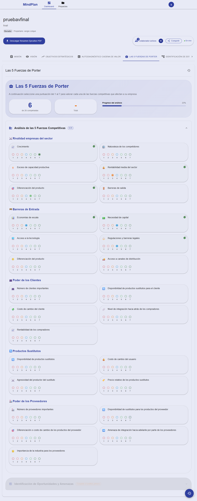

# Examen Práctica Unidad II - PETI

**Estudiante:** [Sergio Colque Ponce]  
**Fecha:** [22-10-2025]  
**Repositorio GitHub:** https://github.com/srg-cp/PE_II_EXAMEN_PRACTICO

## Mejoras Implementadas

### ✅ Mejora 1: Crear el contenedor en Docker que facilitara el despliegue y desarrollo

**Estado: Completada**

Se ha implementado una configuración completa de Docker que incluye:
- Contenedores separados para frontend, backend y base de datos
- Configuración para desarrollo y producción
- Scripts automatizados para facilitar el uso
- Optimización de builds con .dockerignore

## 🐳 Ejecución con Docker

### Prerrequisitos
- Docker
- Docker Compose

### Inicio Rápido

#### Modo Desarrollo
```bash
# En Windows
start.bat dev

# En Linux/Mac
./start.sh dev
```

#### Modo Producción
```bash
# En Windows
start.bat prod

# En Linux/Mac
./start.sh prod
```

### Comandos Disponibles

```bash
# Iniciar en desarrollo
docker-compose -f docker-compose.dev.yml up --build

# Iniciar en producción
docker-compose up --build -d

# Detener contenedores
docker-compose down

# Ver logs
docker-compose logs -f

# Limpiar todo
docker-compose down --rmi all --volumes
```

### URLs de Acceso
- **Frontend**: http://localhost:3000
- **Backend API**: http://localhost:5000
- **MongoDB**: localhost:27017

---

### ✅ Mejora 2: Análisis de las 5 Fuerzas de Porter
- **Descripción:** Implementación completa del análisis estratégico de las 5 Fuerzas de Porter para evaluar la competitividad del sector y posición estratégica de la organización.
- **Funcionalidades agregadas:**
  - **Rivalidad entre Competidores:** Análisis detallado de la intensidad competitiva del sector
  - **Poder de los Clientes:** Evaluación del poder de negociación de los clientes
  - **Poder de los Proveedores:** Análisis del poder de negociación de los proveedores
  - **Productos Sustitutos:** Estudio de amenazas de productos o servicios sustitutos
  - **Barreras de Entrada:** Evaluación de las barreras para nuevos competidores
  - Sistema de calificación por estrellas (1-5) para cada fuerza
  - Interfaz intuitiva con secciones organizadas y navegación fluida
  - Cálculo automático de puntuaciones y análisis de resultados
  - Visualización clara del análisis estratégico completo

**Evidencia visual:**

